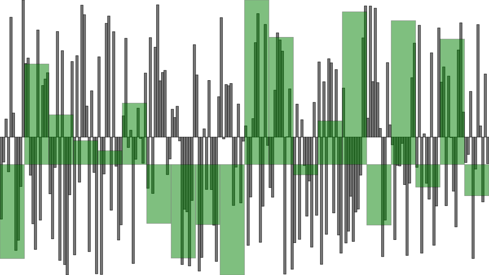

# brute

brute lets you to plot it simple stupid.

## Usage

```clj
(spit "example/800.svg" (plot (repeatedly 800 #(- (rand) 0.5))))
```


```clj
(spit "example/20.svg" (plot (repeatedly 20 #(- (rand) 0.5))))
```



FIXME

## License

Copyright © 2015 FIXME

Distributed under the Eclipse Public License either version 1.0 or (at
your option) any later version.
